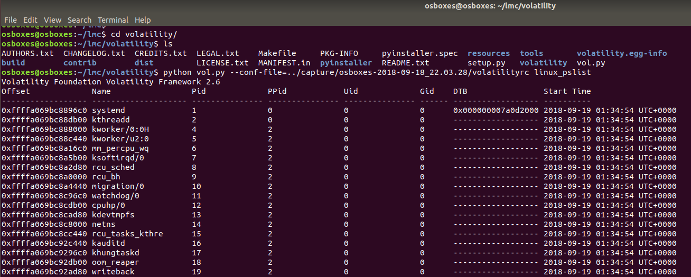

# lmc - Linux Memory Capturer 
## Original author
Linux Memory Grabber - A script for dumping Linux memory and creating Volatility(TM) profiles.\
Hal Pomeranz (hal@deer-run.com), 2016-01-12 \
https://github.com/halpomeranz/lmg , [Hal Pomeranz. "Automating Linux Memory Capture." SANS DFIR Summit, 2014.](http://www.deer-run.com/~hal/AutomatingLinuxMemoryCapture.pdf) 

## Modifier
cpuu (cpuu@icloud.com), 2018-09-19 \
Since Hal Pomeranz's code has not been updated for more than 5 years, I've made some changes and simplified the complexity of the installation process. \
My Blog post : https://cpuu.postype.com 


\
# Getting Started

These instructions will get you a copy of the project up and running on your local machine for development and testing purposes. See deployment for notes on how to deploy the project on a live system.

## Prerequisites

It was tested on Ubuntu version 16.04, 17.10, and 18.04.

```
cpuu@ubuntu:~$ sudo apt-get install yara
cpuu@ubuntu:~$ sudo apt-get install python-pip
cpuu@ubuntu:~$ sudo -H pip install --upgrade pip
cpuu@ubuntu:~$ sudo -H pip install distorm3 pycrypto openpyxl Pillow
```

## Installing

The process of downloading and installing the script from github is as follows,


```
cpuu@ubuntu:~$ git clone https://github.com/cpuu/lmc.git
cpuu@ubuntu:~$ cd lmc
cpuu@ubuntu:~/lmc$ sudo ./setup.sh
```
## Capturing the Memory
Now, as root, run "sudo ./lmc".  This is interactive mode and the user will be prompted for confirmation before lmg builds a LiME module for the system and/or creates a Volatility(TM) profile.
```
cpuu@ubuntu:~/lmc$ sudo ./lmc
```

Two questions will be asked.
* Try to build LiME kernel module? [N|y] 
* Compile profile for this system? [N|y] 

If this is your first time, select 'y' for both.
> cpuu@ubuntu:~/lmc$ sudo ./lmc\
>>**Try to build LiME kernel module? [N|y] y**\
>>>  make -C /lib/modules/4.15.0-34-generic/build M="/home/osboxes/lmc/lime/src" modules\
make[1]: Entering directory '/usr/src/linux-headers-4.15.0-34-generic'\
Makefile:976: "Cannot use CONFIG_STACK_VALIDATION=y, please install libelf-dev, libelf-devel or elfutils-libelf-devel"\
  CC [M]  /home/osboxes/lmc/lime/src/tcp.o\
  CC [M]  /home/osboxes/lmc/lime/src/disk.o\
  CC [M]  /home/osboxes/lmc/lime/src/main.o\
  CC [M]  /home/osboxes/lmc/lime/src/hash.o\
  LD [M]  /home/osboxes/lmc/lime/src/lime.o\
  Building modules, stage 2.\
  MODPOST 1 modules\
  CC      /home/osboxes/lmc/lime/src/lime.mod.o\
  LD [M]  /home/osboxes/lmc/lime/src/lime.ko\
make[1]: Leaving directory '/usr/src/linux-headers-4.15.0-34-generic'\
strip --strip-unneeded lime.ko\
mv lime.ko lime-4.15.0-34-generic-x86_64.ko\
LiME module is /home/osboxes/lmc/lime/src/lime-4.15.0-34-generic-x86_64.ko\
Dumping memory in "lime" format to /home/osboxes/lmc/capture/osboxes-2018-09-18_22.03.28\
This could take a while...Done!\
Cleaning up...Done!\
Grabbing a copy of /bin/bash...Done!\
Writing volatilityrc to /home/osboxes/lmc/capture/osboxes-2018-09-18_22.03.28...Done!\

>>**Compile profile for this system? [N|y] y**
>>> make -C //lib/modules/4.15.0-34-generic/build M="/home/osboxes/lmc/volatility/tools/linux" clean\
make[1]: Entering directory '/usr/src/linux-headers-4.15.0-34-generic'\
make[1]: Leaving directory '/usr/src/linux-headers-4.15.0-34-generic'\
rm -f module.dwarf\
make -C //lib/modules/4.15.0-34-generic/build CONFIG_DEBUG_INFO=y M="/home/osboxes/lmc/volatility/tools/linux" modules\
make[1]: Entering directory '/usr/src/linux-headers-4.15.0-34-generic'\
Makefile:976: "Cannot use CONFIG_STACK_VALIDATION=y, please install libelf-dev, libelf-devel or elfutils-libelf-devel"\
  CC [M]  /home/osboxes/lmc/volatility/tools/linux/module.o\
  Building modules, stage 2.\
  MODPOST 1 modules\
WARNING: modpost: missing MODULE_LICENSE() in /home/osboxes/lmc/volatility/tools/linux/module.o\
see include/linux/module.h for more information\
  CC      /home/osboxes/lmc/volatility/tools/linux/module.mod.o\
  LD [M]  /home/osboxes/lmc/volatility/tools/linux/module.ko\
make[1]: Leaving directory '/usr/src/linux-headers-4.15.0-34-generic'\
dwarfdump -di module.ko > module.dwarf\
make -C //lib/modules/4.15.0-34-generic/build M="/home/osboxes/lmc/volatility/tools/linux" clean\
make[1]: Entering directory '/usr/src/linux-headers-4.15.0-34-generic'\
  CLEAN   /home/osboxes/lmc/volatility/tools/linux/.tmp_versions\
  CLEAN   /home/osboxes/lmc/volatility/tools/linux/Module.symvers\
make[1]: Leaving directory '/usr/src/linux-headers-4.15.0-34-generic'\
  adding: module.dwarf (deflated 89%)\
  adding: boot/System.map-4.15.0-34-generic (deflated 79%)\

Everything else is automated.  After the script runs, you will have a new directory on the thumb drive named `.../capture/<hostname>-YYYY-MM-DD_hh.mm.ss`

the directory will contain:

| filename | description |
| -------- | -------- |
| hostname-YYYY-MM-DD_hh.mm.ss-memory.lime   | the RAM capture          |
| hostname-YYYY-MM-DD_hh.mm.ss-profile.zip   | Volatility(TM) profile   |
| hostname-YYYY-MM-DD_hh.mm.ss-bash  | copy of target's /bin/bash       |
|  volatilityrc                        | prototype Volatility config file |


# Analysing Memory dump
At the end of the capture, you can see that the *capture* directory is created.
```
osboxes@osboxes:~/lmc$ cd capture/
osboxes@osboxes:~/lmc/capture$ cd osboxes-2018-09-18_22.03.28/
osboxes@osboxes:~/lmc/capture/osboxes-2018-09-18_22.03.28$ ls -l volatilityrc 
-rw-r--r-- 1 root root 235 Sep 18 22:04 volatilityrc
```
There is a file called `volatilityrc`. This file defines the appropriate locations for the captured memory and plugin.
```
osboxes@osboxes:~/lmc/capture/osboxes-2018-09-18_22.03.28$ cat volatilityrc 
[DEFAULT]
PLUGINS=/home/osboxes/lmc/capture/osboxes-2018-09-18_22.03.28
PROFILE=Linuxosboxes-2018-09-18_22_03_28-profilex64
LOCATION=file:////home/osboxes/lmc/capture/osboxes-2018-09-18_22.03.28/osboxes-2018-09-18_22.03.28-memory.lime
```
When you run volatility, you can specify `--conf-file=../capture/osboxes-2018-09-18_22.03.28/volatilityrc` and execute the desired plug-in.

## linux_banner
Running linux_banner plugin to test capture, leveraging the prototype volatilityrc
```
cpuu@ubuntu:~/lmc $ cd volatility/
cpuu@ubuntu:~/lmc/volatility$ python vol.py --conf-file=../capture/osboxes-2018-09-18_22.03.28/volatilityrc linux_banner

Volatility Foundation Volatility Framework 2.6
Linux version 4.15.0-34-generic (buildd@lgw01-amd64-047) (gcc version 7.3.0 (Ubuntu 7.3.0-16ubuntu3)) #37-Ubuntu SMP Mon Aug 27 15:21:48 UTC 2018 (Ubuntu 4.15.0-34.37-generic 4.15.18)
```

## linux_pslist

Explain what these tests test and why

```
cpuu@ubuntu:~/lmc/volatility$ python vol.py --conf-file=../capture/osboxes-2018-09-18_22.03.28/volatilityrc linux_pslist
```

[... more output not shown ...]

## Other plug-ins
\More information about other plug-ins can be found in the official homepage document below.
[Linux Command Reference](https://github.com/volatilityfoundation/volatility/wiki/Linux-Command-Reference)
\Below is the book by Andrew case, the developer of volatility.
[Ligh, Michael Hale, et al. The art of memory forensics: detecting malware and threats in windows, linux, and Mac memory. John Wiley & Sons, 2014.](https://news.asis.io/sites/default/files/The%20Art%20of%20Memory%20Forensics.pdf)

# Built With
* [LiME](https://github.com/504ensicsLabs/LiME) - Linux Memory Extractor
* [volatility](https://github.com/volatilityfoundation/volatility) - An advanced memory forensics framework
* [dwarfdump](https://www.prevanders.net/dwarf.html) - DWARF is a debugging file format used by many compilers and debuggers to support source level debugging.
